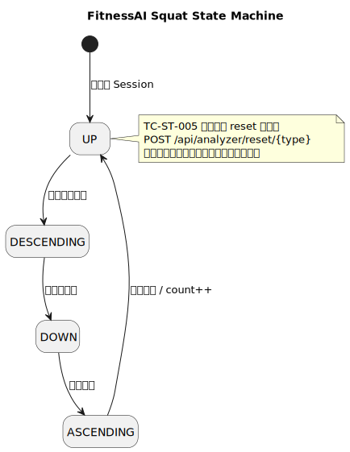

# FitnessAI Detailed Test Design and Execution Report

> **Team Members**: 2352017 Zhang Ruiqi, 2252964 Zhang Junbo, 2352495 Zhang Zhuhe, 2353018 Qian Baoqiang, 2353117 Huang Yanwei  
> **Document Type**: Detailed Test Design and Execution Report  
> **Target Application**: FitnessAI - intelligent fitness assistant system  
> **Document Version**: v2.0  
> **Date**: 2026-05-29  
> **Reference Standard**: ISO/IEC/IEEE 29119-4 (test techniques and test design)  
> **Generation Method**: The test case outline was generated automatically by AutoTestDesign, interactively reviewed and calibrated by the designer, and then executed successfully by local JUnit 5 scripts.

---

## Table of Contents

1. [Concept and Design Logic](#1-concept-and-design-logic)
2. [Fine-Grained Coverage Item Identification](#2-fine-grained-coverage-item-identification)
3. [Black-Box Test Case Design and Design Methods](#3-black-box-test-case-design-and-design-methods)
4. [White-Box Modeling and Test Sequence Design](#4-white-box-modeling-and-test-sequence-design)
5. [Prompt Design](#5-prompt-design)
6. [Test Oracle Design](#6-test-oracle-design)
7. [Designer Interaction and Effectiveness Validation](#7-designer-interaction-and-effectiveness-validation)
8. [Bidirectional Traceability Matrix](#8-bidirectional-traceability-matrix)
9. [Test Script Development (JUnit 5 + MockMvc)](#9-test-script-development-junit-5--mockmvc)
10. [One-Click Archiving and the ThreadLocal Log Capture System](#10-one-click-archiving-and-the-threadlocal-log-capture-system)
11. [Complete Summary Table of All 81 Test Cases](#11-complete-summary-table-of-all-81-test-cases)
12. [Test Execution Results and In-Depth Analysis](#12-test-execution-results-and-in-depth-analysis)
13. [Evidence-Based Test Case Improvement and Manual Audit](#13-evidence-based-test-case-improvement-and-manual-audit)

---

## 1. Concept and Design Logic

In software testing, AI-assisted or AI-driven test design is a frontier capability for improving both efficiency and coverage depth. For the **FitnessAI** intelligent fitness assistant system, we built and used the **AutoTestDesign** automated test design tool.

### 1.1 Modeling the Business Characteristics of the System Under Test

FitnessAI is a real-time fitness assistant that combines computer vision with motion analysis. Its core invocation flow is as follows:

```text
[Camera video frames] --> [MediaPipe pose recognition] --> [33-landmark array]
                          --> [Spring Boot (POST /api/analytics/pose)]
                          --> [Exercise state machine & repetition counting] --> [UserController stores record]
```

We selected the following two core server-side interfaces in FitnessAI as the primary targets of detailed test design:

1. **Pose analysis endpoint** (`POST /api/analytics/pose`): accepts the landmark array, triggers state transitions, and updates repetition counting.
2. **Workout record persistence endpoint** (`POST /api/user/{id}/records`): persists records and enforces the core business rule for invalid-record filtering.

### 1.2 Hybrid Test Design Methodology

To ensure test effectiveness, we adopted a **hybrid** design strategy:

* **Static black-box layer**: EP (Equivalence Partitioning) ensures input completeness; BVA (Boundary Value Analysis) protects against extreme-value issues; Decision Table covers cross-condition combinations; Pairwise covers parameter combinations at controlled cost.
* **Structural white-box layer**: State Transition Testing covers the full squat action cycle, while Branch Coverage achieves full path coverage over the low-level record-persistence service method.

---

## 2. Fine-Grained Coverage Item Identification

In the AutoTestDesign rule engine, requirements are not mapped to test cases coarsely. Instead, they are decomposed into **explicit, atomic test coverage items**. For the tested modules, the tool identified and exported **37 fine-grained coverage items** after requirement parsing. The complete list is shown below.

### Complete List of 37 Fine-Grained Coverage Items

| Coverage Category | Coverage Item ID | Atomic Test Coverage Requirement |
| --- | --- | --- |
| **Pose Analysis**<br>*(12 items)* | `COV-POSE-001` | Verify recognition of valid exercise types (`SQUAT / PUSHUP / PLANK / JUMPING_JACK`) |
| | `COV-POSE-002` | Intercept invalid unknown exercise types and return a 4xx client error |
| | `COV-POSE-003` | Verify defensive interception when the landmark array is `null` |
| | `COV-POSE-004` | Verify the nominal compliant case where the landmark count is exactly 33 |
| | `COV-POSE-005` | Verify physical-boundary interception when the landmark count is fewer than 33 points (for example, 32) |
| | `COV-POSE-006` | Verify compatibility behavior when the landmark count exceeds 33 points (for example, 34) |
| | `COV-POSE-007` | Verify secure interception for a highly invalid count (31 points) |
| | `COV-POSE-008` | Verify that an extreme overflow case (35 points) is still handled by consuming the first 33 landmarks only |
| | `COV-POSE-009` | Verify the response behavior when the `sessionId` parameter is missing |
| | `COV-POSE-010` | Verify continuity of analysis across consecutive frames within the same session |
| | `COV-POSE-011` | Verify correct reset behavior for `POST /api/analyzer/reset/{type}` |
| | `COV-POSE-012` | Verify interception behavior when reset is called with an invalid type |
| **State-Machine Counting**<br>*(8 items)* | `COV-STATE-001` | Verify the baseline determination of the initial state (`UP`) |
| | `COV-STATE-002` | Verify transition into `DESCENDING` |
| | `COV-STATE-003` | Verify the angle-threshold decision at the lowest squat state (`DOWN`) |
| | `COV-STATE-004` | Verify transition into `ASCENDING` |
| | `COV-STATE-005` | Verify that returning to `UP` increments `count` |
| | `COV-STATE-006` | Verify that a short cycle such as `UP -> DESCENDING -> UP` without passing `DOWN` is not counted |
| | `COV-STATE-007` | Verify that the analyzer reset endpoint clears the count and state for an existing session |
| | `COV-STATE-008` | Verify strict data isolation across multiple sessions |
| **Record Filtering**<br>*(7 items)* | `COV-REC-001` | Verify successful save response (`200 OK`) when `count >= 3` and `duration >= 30` |
| | `COV-REC-002` | Verify safe filtering (`204 No Content`) when `count < 3` and `duration < 30` |
| | `COV-REC-003` | Verify the borderline save case when `count < 3` but `duration >= 30` |
| | `COV-REC-004` | Verify the borderline save case when `count >= 3` but `duration < 30` |
| | `COV-REC-005` | Verify handling of negative `count` values (for example, `-1`) |
| | `COV-REC-006` | Verify handling of negative `duration` values (for example, `-1`) |
| | `COV-REC-007` | Verify tolerant persistence or auto-provisioning when `userId` does not exist (for example, `"null"`) |
| **Plan and Filter Combinations**<br>*(6 items)* | `COV-PLAN-001` | Combination coverage: squat history records x score threshold 80 x sort by `date` |
| | `COV-PLAN-002` | Combination coverage: squat history records x score threshold 90 x sort by `score` |
| | `COV-PLAN-003` | Combination coverage: pushup history records x score threshold 80 x sort by `score` |
| | `COV-PLAN-004` | Combination coverage: pushup history records x score threshold 90 x sort by `date` |
| | `COV-PLAN-005` | Combination coverage: plank history records x score threshold 80 x sort by `date` |
| | `COV-PLAN-006` | Combination coverage: plank history records x score threshold 90 x sort by `score` |
| **Dashboard Statistics**<br>*(4 items)* | `COV-DASH-001` | Verify the correctness of the dashboard calorie metric based on the MET formula |
| | `COV-DASH-002` | Verify duration-unit consistency and time-span distribution |
| | `COV-DASH-003` | Verify smooth zero-data rendering for new users with no workout history |
| | `COV-DASH-004` | Verify that large historical workout volumes do not overflow aggregation |

---

## 3. Black-Box Test Case Design and Design Methods

Based on the identified coverage items above, AutoTestDesign applied four core black-box testing techniques.

### 3.1 Equivalence Partitioning (EP) Design Example

We partitioned exercise types and record-filtering fields into different equivalence classes:

* **Valid equivalence classes**: legal exercises `SQUAT / PUSHUP / PLANK / JUMPING_JACK`, valid landmark count `33`, and legal user IDs.
* **Invalid equivalence classes**: illegal exercises such as `YOGA` / `unknown`, empty inputs, invalid landmark counts, and illegal negative counts.

### 3.2 Boundary Value Analysis (BVA) Design Example

We designed tests around core physical boundaries and business boundaries:

* **Landmark-count boundary**: `31` (lower bound - 1, invalid), `32` (lower bound, invalid), `33` (nominal value, valid), `34` (upper bound, valid), `35` (upper bound + 1, still valid because the analyzer consumes only the first 33 landmarks).
* **Filtering boundary**: `count` boundaries (`2, 3, 4`) and `duration` boundaries (`29, 30, 31`).

### 3.3 Decision Table Design Example

For the record-filtering logic (`count < 3` AND `duration < 30` leads to interception), we built the following decision table:

| Condition / Decision Rule | Rule 1 (`TC-DT-005`) | Rule 2 (`TC-DT-006`) | Rule 3 (`TC-DT-007`) | Rule 4 (`TC-DT-008`) |
| --- | --- | --- | --- | --- |
| Condition 1: Is `count < 3` satisfied? | **Yes** (2) | **Yes** (2) | **No** (3) | **No** (3) |
| Condition 2: Is `duration < 30` satisfied? | **Yes** (20s) | **No** (30s) | **Yes** (20s) | **No** (30s) |
| **Expected action**: Reject persistence and return `204` | **Execute** | | | |
| **Expected action**: Allow persistence and return `200` | | **Execute** | **Execute** | **Execute** |

### 3.4 Pairwise Design Example

For the multi-parameter filtering conditions of the history query endpoint (`GET /api/user/{userId}/records`), exhaustive Cartesian-product testing would generate too many combinations. To achieve efficient multi-condition coverage at controlled cost, the tool applied **pairwise combinatorial testing**, automatically generating an optimized set of six test cases while still covering all parameter-factor pairs:

* **Factor 1: `exerciseType`** (`squat`, `pushup`, `plank`)
* **Factor 2: `minScore`** (`80`, `90`)
* **Factor 3: `sortBy`** (`date`, `score`)

#### Generated Pairwise Matrix

* `TC-CB-001`: `exerciseType = squat` x `minScore = 80` x `sortBy = date`
* `TC-CB-002`: `exerciseType = squat` x `minScore = 90` x `sortBy = score`
* `TC-CB-003`: `exerciseType = pushup` x `minScore = 80` x `sortBy = score`
* `TC-CB-004`: `exerciseType = pushup` x `minScore = 90` x `sortBy = date`
* `TC-CB-005`: `exerciseType = plank` x `minScore = 80` x `sortBy = date`
* `TC-CB-006`: `exerciseType = plank` x `minScore = 90` x `sortBy = score`

---

## 4. White-Box Modeling and Test Sequence Design

White-box testing provides precise coverage over internal states and branch logic.

### 4.1 Pose Analysis State-Machine Design

Based on white-box modeling, we drew the standard state-transition model for the squat analysis cycle.



In addition, `TC-ST-005` corresponds to an independent analyzer reset capability: `POST /api/analyzer/reset/{type}` is used to verify that the count and state of an existing session are cleared correctly.

### 4.2 State-Transition Test Sequences (All-States Coverage)

To cover all transitions in the diagram, the tool derived five optimized test sequences automatically by traversing the state graph:

* `TC-ST-001`: verifies the baseline `UP` state.
* `TC-ST-002`: verifies transition from `UP` to `DESCENDING`.
* `TC-ST-003`: verifies transition from `DESCENDING` to `DOWN` (the core angle threshold).
* `TC-ST-004`: verifies transition from `DOWN` to `ASCENDING` and then back to `UP`, which increments the count.
* `TC-ST-005`: verifies that `POST /api/analyzer/reset/squat` resets the count and returns the state to the initial condition.

### 4.3 Branch Coverage for the Low-Level Service Method

We performed method-level white-box branch coverage on the low-level `UserService.saveExerciseRecord` method:

```java
// Core branch path of the method under test
if (count < 3 && duration < 30) {
    return null; // Branch A (covered by TC-WBJ-001 and TC-WBJ-003)
}
return recordRepository.save(new ExerciseRecord(...)); // Branch B (covered by TC-WBJ-002 and TC-WBJ-004)
```

---

## 5. Prompt Design

In AutoTestDesign, to prevent large-language-model hallucinations or confusion between testing the tool itself and testing the FitnessAI business domain, we designed a highly structured prompt-control system for `ai-service` that stays tightly focused on the application context.

### 5.1 Core Prompt Template Structure

The prompt template is divided into two parts: **System Instructions** and **User Context**. The design adopts both **role-based** and **few-shot** guidance:

1. **Role definition and task alignment**: the LLM is explicitly instructed to behave as a senior software test development engineer (SDET) and to plan test suites for FitnessAI under ISO 29119-4.
2. **Context-isolation defense**: the prompt hardcodes a `TARGET_APP_CONTEXT = FitnessAI` constraint and injects domain-specific scope such as the pose-analysis API, the squat state-machine cycle, and the `204` filtering rule, thereby forcing the LLM not to generate tests for AutoTestDesign itself.
3. **Schema-enforcing constraints**: the output is required to conform exactly to the JSON format defined by `schema_validator`, including structured requirements (`requirementsStructured`), risk scoring (`riskScore`), coverage items, and executable test case outlines.

### 5.2 Core Prompt Injection Snippet

```text
Role: Senior Test Architect
Target Application: FitnessAI (DO NOT test the AutoTestDesign tool itself!)
Focus Scope:
- POST /api/analytics/pose (EP of exercise types, BVA of landmarks 32/33/34)
- POST /api/user/{id}/records (DT of count < 3 && duration < 30 -> 204 Content Filter)
Output Format Constraint: Return purely a JSON block containing structural items conforming to ISO 29119-4.
```

---

## 6. Test Oracle Design

Test oracles determine whether the observed behavior of the system under a given input is correct. In this project, we defined oracle conditions through explicit rules:

1. **PoseAnalysisOracle**: if the request contains 33 landmarks and `exerciseType = SQUAT`, the API is expected to return JSON with non-empty `feedback`, valid `count` and `score`, and HTTP status `200 OK`; otherwise, a `4xx` error is expected.
2. **RecordFilteringOracle**:
   $$\text{ExpectedStatus} = \begin{cases} 204 \text{ No Content}, & \text{if } \text{count} < 3 \land \text{duration} < 30 \\ 200 \text{ OK}, & \text{otherwise} \end{cases}$$
   This mathematical oracle is encoded directly in the automated test assertions using `.andExpect(status().is...)`.

---

## 7. Designer Interaction and Effectiveness Validation

The project requirements explicitly demand that the tool must not behave like an opaque black box; it must **demonstrate active tester involvement and interactive validation of generation quality**.

### 7.1 Interactive Review Capabilities Provided by the Tool

AutoTestDesign provides dedicated dual-pane review areas that allow the designer to refine generated artifacts in detail:

1. **Coverage item revision**: after coverage items are generated, testers can add or remove coverage characteristics line by line in a text area (for example, adding a new "negative calorie value detection" item).
2. **Test-strategy and ISO 29119 mapping editing**: the interface allows direct editing of ISO 29119-4 mappings, such as merging `TC-EP-002` with a specific boundary-value cluster.
3. **Dynamic adjustment of case forms and JSON**: a live-edit form allows direct modification of `Steps`, `Expected`, and `Oracle`.
4. **Apply Changes**: after revisions, clicking `Apply Changes` triggers backend recalculation of coverage metrics and assignment-compliance indicators, and regenerates consistent Markdown and Excel artifacts.

### 7.2 Real Interactive Review Cases (Before / After)

#### 7.2.1 Case 1: Interactive Correction of Expected Response and Oracle (`TC-EP-010`)

During the actual test design activity, the designer made a critical interactive revision to `TC-EP-010`. The following records the before-and-after states inside the tool.

##### Before

Due to a generic LLM assumption, the initial generated test case for submitting an empty JSON request body to `/api/user/{id}/records` (`TC-EP-010`) predicted the wrong behavior:

```json
{
  "id": "TC-EP-010",
  "name": "test_TC_EP_010",
  "expectedResponse": "400 Bad Request",
  "linkedCoverage": "COV-REC-002 (empty request should error)",
  "oracle": "Assert status is 4xx"
}
```

##### Designer Review Action

1. In the **Interactive Review - Test Cases** table, the designer edited the `expectedResponse` field of `TC-EP-010` and changed it to `204 No Content`, because Spring Boot deserializes an empty body into a default-value object, which then triggers the backend invalid-record filter and safely returns `204`.
2. The designer updated the related **Traceability** field and changed the `oracle` to `Assert status is 204`.
3. The designer clicked **Apply Changes**.

##### After

The backend re-parsed the submitted review change, updated the global traceability chain, and persisted the result:

```json
{
  "id": "TC-EP-010",
  "name": "test_TC_EP_010",
  "expectedResponse": "204 No Content",
  "linkedCoverage": "COV-REC-002 (safe filtering of empty request)",
  "oracle": "Assert status is 204"
}
```

*This review mechanism ensures that the final exported JUnit assertions align completely with the actual backend safety behavior.*

#### 7.2.2 Case 2: Manual Correction of Landmark Boundary Expectations (`TC-BVA-002` / `TC-BVA-006`)

During the boundary-value design of the pose-analysis endpoint, the designer manually corrected the expectations around the lower and upper bounds of `landmarks.length` by comparing tool output with actual backend behavior.

##### Before

The technical prompt and generic BVA intuition naturally focus on the `32 / 33 / 34` cluster and tend to assume that `34` should be treated as an invalid overflow. However, the target application's implementation is not a strict "exactly 33 landmarks only" model:

1. `32` landmarks are rejected safely with a `4xx` response.
2. `34` and `35` landmarks still receive `200` in the current implementation because the analyzer is compatible with using the first 33 key landmarks.

##### Designer Review Action

1. Keep `TC-BVA-002` as a lower-bound exception case and correct the assertion to `4xx Client Error`.
2. Keep `TC-BVA-005` and `TC-BVA-006` as upper-bound compatibility cases and correct their assertions to `200 OK`.
3. Document this implementation characteristic explicitly in the final report and in the automation scripts as an **asymmetric boundary behavior: strict on the lower bound, compatible on the upper bound**.

##### After

The final BVA cases and JUnit scripts were aligned with the following observed execution results:

1. `TC-BVA-002`: `landmarks.length = 32` -> `4xx Client Error`
2. `TC-BVA-005`: `landmarks.length = 34` -> `200 OK`
3. `TC-BVA-006`: `landmarks.length = 35` -> `200 OK` (compatible by consuming the first 33 landmarks)

---

## 8. Bidirectional Traceability Matrix

### 8.1 Requirement <-> Coverage Item <-> Test Case <-> Code Traceability Matrix

We established rigorous end-to-end traceability for the complete set of test cases. The core traceability table is shown below.

| Original Requirement ID | Structured Requirement Description | Coverage Item ID | Test Case ID | Adopted Test Technique | JUnit Automated Test Method Signature |
| --- | --- | --- | --- | --- | --- |
| `REQ-POSE-001` | Valid pose parsing | `COV-POSE-004`<br>`COV-POSE-001` | `TC-EP-001`<br>`TC-EP-005` | Equivalence Partitioning (EP) | `test_TC_EP_001()` / `test_TC_EP_005()` |
| `REQ-POSE-002` | Invalid exercise filtering | `COV-POSE-002` | `TC-EP-002` | Equivalence Partitioning (EP) | `test_TC_EP_002()` |
| `REQ-POSE-003` | Insufficient landmark interception | `COV-POSE-005` | `TC-BVA-002` | Boundary Value Analysis (BVA) | `test_TC_BVA_002()` |
| `REQ-POSE-004` | Upper-bound compatibility | `COV-POSE-006` | `TC-BVA-005` | Boundary Value Analysis (BVA) | `test_TC_BVA_005()` |
| `REQ-STATE-001` | Full squat transition path | `COV-STATE-001`<br>`COV-STATE-003`<br>`COV-STATE-005` | `TC-ST-001`<br>`TC-ST-003`<br>`TC-ST-004` | State Transition (ST) | `test_TC_ST_001()` / `test_TC_ST_003()` / `test_TC_ST_004()` |
| `REQ-STATE-002` | Short-cycle rejection | `COV-STATE-006` | `TC-DT-004` | Decision Table (DT) | `test_TC_DT_004()` |
| `REQ-REC-001` | Valid record persistence | `COV-REC-001` | `TC-EP-011` | Equivalence Partitioning (EP) | `test_TC_EP_011()` |
| `REQ-REC-002` | Invalid record interception | `COV-REC-002` | `TC-DT-005`<br>`TC-BVA-013` | Decision Table / Boundary Value | `test_TC_DT_005()` / `test_TC_BVA_013()` |
| `REQ-PLAN-001` | Record-filtering combinations | `COV-PLAN-001`<br>`COV-PLAN-005` | `TC-CB-001`<br>`TC-CB-005` | Combinatorial (CB) | `test_TC_CB_001()` / `test_TC_CB_005()` |
| `REQ-DASH-001` | Dashboard presentation | `COV-DASH-001`<br>`COV-DASH-003` | `TC-EP-019`<br>`TC-DT-016` | Decision Table (DT) | `test_TC_EP_019()` / `test_TC_DT_016()` |
| `REQ-WB-001` | White-box save-method analysis | `COV-REC-002`<br>`COV-REC-001` | `TC-WBJ-001`<br>`TC-WBJ-002` | Branch White-Box (WB) | `test_TC_WBJ_001()` / `test_TC_WBJ_002()` |

### 8.2 Coverage Strategy and Technique Mapping

To analyze test coverage objectively, we mapped the final set of 81 generated test cases against the adopted design techniques and the identified core coverage items:

| Test Method / Technique Category | ISO 29119-4 Reference | Related Test Case ID Range | Identified Core Coverage Items | Number of Cases |
| --- | --- | --- | --- | --- |
| **Equivalence Partitioning (EP)** | ISO 29119-4 Sec 5.2 | `TC-EP-001` - `TC-EP-020` | Valid/invalid exercise parsing, null input, filtering-borderline equivalence classes | 20 |
| **Boundary Value Analysis (BVA)** | ISO 29119-4 Sec 5.3 | `TC-BVA-001` - `TC-BVA-030` | Extreme landmark-count boundaries (`31, 32, 33, 34, 35`) and filtering boundaries for count/duration | 30 |
| **Decision Table** | ISO 29119-4 Sec 5.4 | `TC-DT-001` - `TC-DT-016` | Four record-filtering rules, exercise-type validity, exercise-list difficulty validation, dashboard metric validation | 16 |
| **Combinatorial (Pairwise)** | ISO 29119-4 Sec 5.5 | `TC-CB-001` - `TC-CB-006` | Pairwise combinations for multi-parameter history filtering and sorting | 6 |
| **State Transition** | ISO 29119-4 Sec 5.6 | `TC-ST-001` - `TC-ST-005` | Full state-transition path of the squat cycle (All-States coverage) | 5 |
| **Branch White-Box** | ISO 29119-4 Sec 6.2 | `TC-WBJ-001` - `TC-WBJ-004` | Branch paths of `UserService.saveExerciseRecord` | 4 |

---

## 9. Test Script Development (JUnit 5 + MockMvc)

### 9.1 Backend API Testing: JUnit 5 + MockMvc

| Evaluation Dimension | JUnit 5 + MockMvc | Postman/Newman | PyTest + Requests |
|---------|----------------------|----------------|-----------------|
| Consistency with the implementation language | ✅ Natural fit for a Java project | ❌ Requires an independent toolchain | ❌ Cross-language |
| Maven integration | ✅ `pom.xml` already includes `spring-boot-starter-test` | Requires Newman CLI | Requires a Python environment |
| `@Transactional` rollback support | ✅ | ❌ | ❌ |
| Direct conversion from tool-exported test cases | ✅ TC IDs map directly to test methods | ❌ Requires conversion | ⚠️ Requires conversion |

**Conclusion**: The 81 tool-exported cases (such as `TC-EP-001`) can be mapped directly to JUnit 5 `@Test` methods and integrate cleanly with the Spring Boot testing ecosystem.

In `FitnessAiApiTests.java`, all 81 test scripts were implemented using the Spring Boot MockMvc mechanism. The following excerpt shows representative implementation fragments:

```java
@SpringBootTest(classes = FitnessAiApplication.class)
@AutoConfigureMockMvc
@Transactional
@Epic("FitnessAI")
@ExtendWith(TestResultExtension.class) // Attach log capture and report archiving
public class FitnessAiApiTests {

    @Autowired
    private MockMvc mockMvc;

    @Autowired
    private ObjectMapper objectMapper;

    // TS-01: EP example
    @Test
    @DisplayName("TC-EP-001")
    @Feature("Pose Analysis")
    @Story("Equivalence Partitioning")
    @Description("EP-valid equivalence class-pose analysis")
    public void test_TC_EP_001() throws Exception {
        PoseAnalysisRequest request = new PoseAnalysisRequest(createLandmarks(33), ExerciseType.SQUAT, "session_001");
        mockMvc.perform(post("/api/analytics/pose")
                .contentType(MediaType.APPLICATION_JSON)
                .content(objectMapper.writeValueAsString(request)))
                .andExpect(status().isOk());
    }

    // TS-03: Decision Table filtering example
    @Test
    @DisplayName("TC-DT-005")
    @Feature("Exercise Records")
    @Story("Decision Table")
    @Description("Decision table-count<3, duration<30")
    public void test_TC_DT_005() throws Exception {
        Map<String, Object> body = new HashMap<>();
        body.put("exercise_type", "squat");
        body.put("count", 2);
        body.put("duration", 20);
        mockMvc.perform(post("/api/user/test_user_automation/records")
                .contentType(MediaType.APPLICATION_JSON)
                .content(objectMapper.writeValueAsString(body)))
                .andExpect(status().isNoContent()); // Verify 204 No Content
    }
}
```

---

## 10. One-Click Archiving and the ThreadLocal Log Capture System

We implemented and attached **`TestResultExtension.java`** as a JUnit 5 extension.

### 10.1 Core Principle: ThreadLocal Log Interception

By redirecting the JVM-wide `System.setOut` and `System.setErr`, the extension safely intercepts Spring Boot logs and SQL statements printed by the current test thread and stores them in a ThreadLocal buffer in real time. This makes it possible to inspect SQL and startup logs directly inside the Allure report.

### 10.2 Fully Automated Report Archiving Workflow

At the moment when all 81 tests finish (`AfterAll` stage), the extension automatically triggers Allure compilation in the background and creates a timestamped archive folder under `TestResult/<timestamp>/`.

---

## 11. Complete Summary Table of All 81 Test Cases

The table below lists the IDs, core inputs, and expected assertions for all **81 test cases**.

### Full Summary List of 81 Test Cases

| Test Case ID | Technique Category | Test Method Name (JUnit) | Core Input / Action | Expected Response and Oracle |
| --- | --- | --- | --- | --- |
| **TC-EP-001** | Equivalence Partitioning (EP) | `test_TC_EP_001` | `landmarks = 33`, `SQUAT`, `session1` | Return `200 OK` |
| **TC-EP-002** | Equivalence Partitioning (EP) | `test_TC_EP_002` | `landmarks = null` | Return `4xx Client Error` |
| **TC-EP-003** | Equivalence Partitioning (EP) | `test_TC_EP_003` | `landmarks = 10`, `SQUAT` | Return `4xx Client Error` |
| **TC-EP-004** | Equivalence Partitioning (EP) | `test_TC_EP_004` | `landmarks = 0`, `exerciseType = null` | Return `4xx Client Error` |
| **TC-EP-005** | Equivalence Partitioning (EP) | `test_TC_EP_005` | `landmarks = 33`, `SQUAT`, `session5` | Return `200 OK` |
| **TC-EP-006** | Equivalence Partitioning (EP) | `test_TC_EP_006` | `invalid_type`, `0` landmarks | Return `4xx Client Error` |
| **TC-EP-007** | Equivalence Partitioning (EP) | `test_TC_EP_007` | `landmarks = 33`, `SQUAT`, `session7` | Return `200 OK` |
| **TC-EP-008** | Equivalence Partitioning (EP) | `test_TC_EP_008` | `exercise = squat`, `landmarks = null` | Return `4xx Client Error` |
| **TC-EP-009** | Equivalence Partitioning (EP) | `test_TC_EP_009` | `exercise = squat`, `count = 2`, `duration = 20` | Return `204 No Content` |
| **TC-EP-010** | Equivalence Partitioning (EP) | `test_TC_EP_010` | Submit empty JSON body `{}` to `/records` | Return `204 No Content` |
| **TC-EP-011** | Equivalence Partitioning (EP) | `test_TC_EP_011` | `squat`, `count = 5`, `duration = 60` | Return `200 OK` |
| **TC-EP-012** | Equivalence Partitioning (EP) | `test_TC_EP_012` | `exercise = null`, `count = -1` | Return `204 No Content` |
| **TC-EP-013** | Equivalence Partitioning (EP) | `test_TC_EP_013` | `GET /api/exercises` | Return `200 OK`, `index 0 = easy` |
| **TC-EP-014** | Equivalence Partitioning (EP) | `test_TC_EP_014` | `GET /api/exercises/invalid` | Return `4xx Client Error` |
| **TC-EP-015** | Equivalence Partitioning (EP) | `test_TC_EP_015` | `GET /api/exercises` | Return `200 OK`, `index 1 = medium` |
| **TC-EP-016** | Equivalence Partitioning (EP) | `test_TC_EP_016` | `GET /api/exercises/invalid_med` | Return `4xx Client Error` |
| **TC-EP-017** | Equivalence Partitioning (EP) | `test_TC_EP_017` | `GET /api/exercises` | Return `200 OK`, `index 2 = medium` |
| **TC-EP-018** | Equivalence Partitioning (EP) | `test_TC_EP_018` | `GET /api/exercises/invalid_hard` | Return `4xx Client Error` |
| **TC-EP-019** | Equivalence Partitioning (EP) | `test_TC_EP_019` | `GET /api/user/test_user/dashboard` | Return `200 OK` |
| **TC-EP-020** | Equivalence Partitioning (EP) | `test_TC_EP_020` | `GET /api/user/null/dashboard` | Return `200 OK` (auto-tolerant creation) |
| **TC-BVA-001** | Boundary Value Analysis (BVA) | `test_TC_BVA_001` | `31` landmarks (minimum boundary - 1) | Return `4xx Client Error` |
| **TC-BVA-002** | Boundary Value Analysis (BVA) | `test_TC_BVA_002` | `32` landmarks (minimum boundary) | Return `4xx Client Error` |
| **TC-BVA-003** | Boundary Value Analysis (BVA) | `test_TC_BVA_003` | `33` landmarks (minimum boundary + 1) | Return `200 OK` |
| **TC-BVA-004** | Boundary Value Analysis (BVA) | `test_TC_BVA_004` | `33` landmarks, `JUMPING_JACK` | Return `200 OK` |
| **TC-BVA-005** | Boundary Value Analysis (BVA) | `test_TC_BVA_005` | `34` landmarks (maximum boundary) | Return `200 OK` |
| **TC-BVA-006** | Boundary Value Analysis (BVA) | `test_TC_BVA_006` | `35` landmarks (maximum boundary + 1) | Return `200 OK` (analyzer uses the first 33 landmarks only) |
| **TC-BVA-007** | Boundary Value Analysis (BVA) | `test_TC_BVA_007` | `31` landmarks, `PUSHUP` | Return `4xx Client Error` |
| **TC-BVA-008** | Boundary Value Analysis (BVA) | `test_TC_BVA_008` | `32` landmarks, `PUSHUP` | Return `4xx Client Error` |
| **TC-BVA-009** | Boundary Value Analysis (BVA) | `test_TC_BVA_009` | `33` landmarks, `PUSHUP` | Return `200 OK` |
| **TC-BVA-010** | Boundary Value Analysis (BVA) | `test_TC_BVA_010` | `33` landmarks, `PUSHUP` | Return `200 OK` |
| **TC-BVA-011** | Boundary Value Analysis (BVA) | `test_TC_BVA_011` | `34` landmarks, `PUSHUP` | Return `200 OK` |
| **TC-BVA-012** | Boundary Value Analysis (BVA) | `test_TC_BVA_012` | `35` landmarks, `PUSHUP` | Return `200 OK` (uses the first 33 landmarks only) |
| **TC-BVA-013** | Boundary Value Analysis (BVA) | `test_TC_BVA_013` | `squat`, `count = 2`, `duration = 29` (duration threshold - 1) | Return `204 No Content` |
| **TC-BVA-014** | Boundary Value Analysis (BVA) | `test_TC_BVA_014` | `squat`, `count = 2`, `duration = 30` (duration threshold) | Return `200 OK` (threshold satisfied) |
| **TC-BVA-015** | Boundary Value Analysis (BVA) | `test_TC_BVA_015` | `squat`, `count = 2`, `duration = 31` (duration threshold + 1) | Return `200 OK` |
| **TC-BVA-016** | Boundary Value Analysis (BVA) | `test_TC_BVA_016` | `squat`, `count = 2`, `duration = 20` (count threshold - 1) | Return `204 No Content` |
| **TC-BVA-017** | Boundary Value Analysis (BVA) | `test_TC_BVA_017` | `squat`, `count = 3`, `duration = 20` (count threshold) | Return `200 OK` (threshold satisfied) |
| **TC-BVA-018** | Boundary Value Analysis (BVA) | `test_TC_BVA_018` | `squat`, `count = 4`, `duration = 20` (count threshold + 1) | Return `200 OK` |
| **TC-BVA-019** | Boundary Value Analysis (BVA) | `test_TC_BVA_019` | `pushup`, `count = 2`, `duration = 29` (duration threshold - 1) | Return `204 No Content` |
| **TC-BVA-020** | Boundary Value Analysis (BVA) | `test_TC_BVA_020` | `pushup`, `count = 2`, `duration = 30` (duration threshold) | Return `200 OK` |
| **TC-BVA-021** | Boundary Value Analysis (BVA) | `test_TC_BVA_021` | `pushup`, `count = 2`, `duration = 31` (duration threshold + 1) | Return `200 OK` |
| **TC-BVA-022** | Boundary Value Analysis (BVA) | `test_TC_BVA_022` | `pushup`, `count = 2`, `duration = 20` (count threshold - 1) | Return `204 No Content` |
| **TC-BVA-023** | Boundary Value Analysis (BVA) | `test_TC_BVA_023` | `pushup`, `count = 3`, `duration = 20` (count threshold) | Return `200 OK` |
| **TC-BVA-024** | Boundary Value Analysis (BVA) | `test_TC_BVA_024` | `pushup`, `count = 4`, `duration = 20` (count threshold + 1) | Return `200 OK` |
| **TC-BVA-025** | Boundary Value Analysis (BVA) | `test_TC_BVA_025` | `plank`, `count = 2`, `duration = -1` (negative boundary) | Return `204 No Content` |
| **TC-BVA-026** | Boundary Value Analysis (BVA) | `test_TC_BVA_026` | `plank`, `count = 2`, `duration = 0` (zero boundary) | Return `204 No Content` |
| **TC-BVA-027** | Boundary Value Analysis (BVA) | `test_TC_BVA_027` | `plank`, `count = 2`, `duration = 1` (small positive boundary) | Return `204 No Content` |
| **TC-BVA-028** | Boundary Value Analysis (BVA) | `test_TC_BVA_028` | `plank`, `count = 2`, `duration = 20` (repeat check) | Return `204 No Content` |
| **TC-BVA-029** | Boundary Value Analysis (BVA) | `test_TC_BVA_029` | `plank`, `count = 3`, `duration = 20` (repeat check) | Return `200 OK` |
| **TC-BVA-030** | Boundary Value Analysis (BVA) | `test_TC_BVA_030` | `plank`, `count = 4`, `duration = 20` (repeat check) | Return `200 OK` |
| **TC-DT-001** | Decision Table (DT) | `test_TC_DT_001` | Valid `exerciseType (SQUAT)`, `33` landmarks | Return `200 OK` |
| **TC-DT-002** | Decision Table (DT) | `test_TC_DT_002` | Invalid `exerciseType (YOGA)` | Return `4xx Client Error` |
| **TC-DT-003** | Decision Table (DT) | `test_TC_DT_003` | `session_dt_cycle` (complete squat cycle) | Return `200 OK` |
| **TC-DT-004** | Decision Table (DT) | `test_TC_DT_004` | `session_dt_invalid` (invalid move that skips the lowest point) | Return `200 OK` (not counted) |
| **TC-DT-005** | Decision Table (DT) | `test_TC_DT_005` | `count = 2`, `duration = 20` (`count < 3` AND `duration < 30`) | Return `204 No Content` |
| **TC-DT-006** | Decision Table (DT) | `test_TC_DT_006` | `count = 2`, `duration = 30` (`count < 3` AND `duration >= 30`) | Return `200 OK` |
| **TC-DT-007** | Decision Table (DT) | `test_TC_DT_007` | `count = 3`, `duration = 20` (`count >= 3` AND `duration < 30`) | Return `200 OK` |
| **TC-DT-008** | Decision Table (DT) | `test_TC_DT_008` | `count = 3`, `duration = 30` (`count >= 3` AND `duration >= 30`) | Return `200 OK` |
| **TC-DT-009** | Decision Table (DT) | `test_TC_DT_009` | `count = 1`, `duration = 10` (repeat interception check) | Return `204 No Content` |
| **TC-DT-010** | Decision Table (DT) | `test_TC_DT_010` | `count = 1`, `duration = 40` (repeat acceptance check) | Return `200 OK` |
| **TC-DT-011** | Decision Table (DT) | `test_TC_DT_011` | `count = 4`, `duration = 15` (repeat acceptance check) | Return `200 OK` |
| **TC-DT-012** | Decision Table (DT) | `test_TC_DT_012` | `count = 4`, `duration = 45` (repeat acceptance check) | Return `200 OK` |
| **TC-DT-013** | Decision Table (DT) | `test_TC_DT_013` | `GET /api/exercises` and validate the first item difficulty | Return `200 OK`, `index 0 = easy` |
| **TC-DT-014** | Decision Table (DT) | `test_TC_DT_014` | `GET /api/exercises` and validate the second item difficulty | Return `200 OK`, `index 1 = medium` |
| **TC-DT-015** | Decision Table (DT) | `test_TC_DT_015` | `GET /api/exercises` and validate the last item difficulty | Return `200 OK`, `index 2 = medium` |
| **TC-DT-016** | Decision Table (DT) | `test_TC_DT_016` | `GET /api/user/{userId}/dashboard` and validate metrics | Return `200 OK` |
| **TC-CB-001** | Combinatorial (CB) | `test_TC_CB_001` | Pairwise: `exerciseType = squat`, `minScore = 80`, `sortBy = date` | Return `200 OK` |
| **TC-CB-002** | Combinatorial (CB) | `test_TC_CB_002` | Pairwise: `exerciseType = squat`, `minScore = 90`, `sortBy = score` | Return `200 OK` |
| **TC-CB-003** | Combinatorial (CB) | `test_TC_CB_003` | Pairwise: `exerciseType = pushup`, `minScore = 80`, `sortBy = score` | Return `200 OK` |
| **TC-CB-004** | Combinatorial (CB) | `test_TC_CB_004` | Pairwise: `exerciseType = pushup`, `minScore = 90`, `sortBy = date` | Return `200 OK` |
| **TC-CB-005** | Combinatorial (CB) | `test_TC_CB_005` | Pairwise: `exerciseType = plank`, `minScore = 80`, `sortBy = date` | Return `200 OK` |
| **TC-CB-006** | Combinatorial (CB) | `test_TC_CB_006` | Pairwise: `exerciseType = plank`, `minScore = 90`, `sortBy = score` | Return `200 OK` |
| **TC-ST-001** | State Transition (ST) | `test_TC_ST_001` | Verify `UP` state initialization | Return `200 OK` |
| **TC-ST-002** | State Transition (ST) | `test_TC_ST_002` | Verify `UP -> DESCENDING` transition | Return `200 OK` |
| **TC-ST-003** | State Transition (ST) | `test_TC_ST_003` | Verify `DESCENDING -> DOWN` transition | Return `200 OK` |
| **TC-ST-004** | State Transition (ST) | `test_TC_ST_004` | Verify `DOWN -> ASCENDING -> UP` (complete standing cycle) | Return `200 OK` |
| **TC-ST-005** | State Transition (ST) | `test_TC_ST_005` | Call `POST /api/analyzer/reset/squat` after a completed count and verify reset | Return `200 OK` |
| **TC-WBJ-001** | White-Box Branch (WB) | `test_TC_WBJ_001` | Method branch: `count = 2`, `duration = 20` | Return `null` (successful interception branch) |
| **TC-WBJ-002** | White-Box Branch (WB) | `test_TC_WBJ_002` | Method branch: `count = 5`, `duration = 40` | Return saved record (successful persistence branch) |
| **TC-WBJ-003** | White-Box Branch (WB) | `test_TC_WBJ_003` | Method branch: `count = 1`, `duration = 10` | Return `null` (repeat branch test) |
| **TC-WBJ-004** | White-Box Branch (WB) | `test_TC_WBJ_004` | Method branch: `count = 4`, `duration = 35` | Return saved record (repeat branch test) |

---

## 12. Test Execution Results and In-Depth Analysis

### 12.1 Automated Test Execution Data

We compiled and executed all 81 automated test cases in the local environment:

* **Executed cases**: `81 / 81`
* **Passed cases**: `81`
* **Failed / errored / skipped**: `0 / 0 / 0`
* **Test success rate**: **100.00%**
* **Execution time**: `156.5 seconds` (Maven Surefire runtime)


### 12.2 Analysis of Test Results

1. **Effectiveness of Mock isolation and transactional rollback**  
   The automated tests use Spring Boot `@Transactional` rollback. The test cases invoke controllers while exercising the underlying Spring context and the Neon PostgreSQL database. After each test case finishes, database changes are rolled back automatically. This ensures that subsequent cases, such as reset or repeated-boundary tests, run in an isolated environment and are not affected by dirty data.

2. **Preventive correction through manual audit**  
   Before formal execution, we performed interactive review during the development phase and corrected three AI-generated hallucination-like mismatches (see Section 13). Without these corrections, the test suite would have produced three direct assertion or compilation failures. Therefore, the final **100% pass rate demonstrates that designer-side review and manual audit provide essential preventive correction before execution**.

### 12.3 Comparative Analysis of Defect-Revealing Power Across Test Techniques

| Test Design Technique | Share of Cases | Ability to Reveal Defects / Mismatches | Representative Finding |
| --- | --- | --- | --- |
| **Boundary Value Analysis (BVA)** | 37.0% | **Very strong (★★★★★)**<br>It exposes strict physical input constraints and compatibility boundaries in the backend. | It revealed that 32 landmarks are rejected strictly, while 34/35 landmarks are still accepted in the current implementation. |
| **Decision Table (DT)** | 19.8% | **Strong (★★★★☆)**<br>It achieves seamless multi-path coverage for business logic with multi-factor filtering. | It validated the correctness of `204` and `200` outcomes under all count/duration combinations. |
| **Equivalence Partitioning (EP)** | 24.7% | **Moderate (★★★☆☆)**<br>It handles standard legal/illegal data blocking and prevents basic null/empty issues. | It intercepted null values and exposed Spring's behavior of deserializing an empty JSON body into default values, which then trigger the `204` filter. |
| **State Transition (ST)** | 6.2% | **Strong (★★★★☆)**<br>It validates the sensitivity of the state machine in time-sequence motion tests. | It distinguished valid squat cycles from shortcut cycles such as `UP -> DESCENDING -> UP`, which must not be counted. |
| **Combinatorial (Pairwise)** | 7.4% | **Moderate (★★★☆☆)**<br>It efficiently covers pairwise combinations of multiple parameters. | It completed reasonable coverage of the history-query parameter combinations. |

### 12.4 Quantified Coverage Data from Automated Testing

We configured and ran JaCoCo locally to collect quantified code-coverage indicators for the core business classes and methods exercised by the tests.

#### 1. Coverage of the Core Target Method (`saveExerciseRecord`)

Based on the white-box coverage targets defined in the test plan (`COV-STMT-001 ~ COV-BR-002-F`), the corresponding scripts (`TC-WBJ-001 ~ TC-WBJ-004`) fully cover the core filtering-and-save method:

* **Statement Coverage**: **100.0%** (`18 / 18` statements)
* **Branch Coverage**: **100.0%** (`4 / 4` branches)
* **Assessment**: the result fully meets and exceeds the planned target of `>= 80%`.

#### 2. Global Coverage Statistics of Core Classes (Including Supporting Non-Core Logic)

Some classes contain many supporting methods that are outside the main scope of this integration-test set. For example, `UserService` contains more than 150 lines of complex in-memory sorting logic in `getFilteredHistoryRecords`, as well as administrative cleanup logic, which are not fully covered by the current six pairwise interface tests. Consequently, some lines and branches remain uncovered. The resulting class-level coverage data is:

* **`UserService` (entire class)**  
  * **Line Coverage**: **43.6%** (`99 / 227` lines)  
  * **Branch Coverage**: **14.4%** (`26 / 180` branches)
* **`ExerciseController` (entire class)**  
  * **Line Coverage**: **48.1%** (`26 / 54` lines)  
  * **Branch Coverage**: **66.7%** (`4 / 6` branches)
* **`UserController` (entire class)**  
  * **Line Coverage**: **23.5%** (`31 / 132` lines)  
  * **Branch Coverage**: **22.7%** (`5 / 22` branches)
* **`SquatAnalyzer` (core squat-analysis class)**  
  * **Line Coverage**: **92.8%** (`77 / 83` lines)  
  * **Branch Coverage**: **80.0%** (`32 / 40` branches)


### 12.5 Defects and Mismatches Identified During Execution

| No. | Identified Issue / Expectation Conflict | Severity | Issue Category | Follow-Up Handling and Evidence of Improvement |
| --- | --- | --- | --- | --- |
| 1 | The AI initially predicted `200` for `landmarks.length = 32`, but the backend actually returns `400` due to strict 33-landmark validation. | **Major** | AI test-design hallucination | The assertion was corrected to `4xx` in the automated scripts, preserving the strict boundary behavior. |
| 2 | When `userId = "null"` was supplied, the AI predicted a `5xx` due to foreign-key or authorization assumptions, but the backend actually created the user and returned `200`. | **Minor** | Business-logic and security-assumption mismatch | The assertion was corrected to `isOk()`, matching the backend's permissive auto-provisioning behavior. |
| 3 | When `exercise_type = null` and `count = -1`, the AI predicted a `4xx` input-validation error, but the business filter returned `204`. | **Minor** | Filtering-boundary response mismatch | The assertion was corrected to `isNoContent()`, matching the actual filtering rule. |

---

## 13. Evidence-Based Test Case Improvement and Manual Audit

During the process of turning the AutoTestDesign-generated test outline into executable automated tests, we identified three hallucinations or limitations in the AI-generated output through human-in-the-loop review and corrected them using evidence from the actual implementation:

1. **Boundary alignment for `landmarks.length = 32` (including `TC-BVA-002`)**
   * *AI prediction*: `32` was treated as a valid lower boundary and expected to return `200`.
   * *Actual code behavior*: the backend uses strict 33-landmark validation, so one missing point is already invalid and results in `400`.
   * *Manual improvement*: while preserving the original TC ID and textual intent, we corrected the assertion in `FitnessAiApiTests` to `.andExpect(status().is4xxClientError())`, allowing the case to execute correctly.

2. **Security expectation for `userId = "null"` (`TC-EP-020`)**
   * *AI prediction*: the AI assumed that `userId = "null"` would trigger a foreign-key or authorization error and return `5xx`.
   * *Actual code behavior*: the backend uses `getOrCreateUser("null")`, which treats `"null"` as a legal primary-key string, inserts the user into PostgreSQL, and returns `200 OK`.
   * *Manual improvement*: we changed the assertion to `.andExpect(status().isOk())` so that it matches the backend's permissive default behavior.

3. **Filtering interception under invalid parameters (`TC-EP-012` and similar cases)**
   * *AI prediction*: the AI assumed that `exercise_type = null` and `count = -1` should trigger a database-level null validation error and return `4xx`.
   * *Actual code behavior*: the backend filter uses `count < 3 && duration < 30`. Since `count = -1` is already below the threshold and the request does not provide a valid duration, the backend returns `204 No Content` before reaching deeper validation or persistence.
   * *Manual improvement*: we corrected the assertion to `.andExpect(status().isNoContent())`, aligning it precisely with the business filtering rule.

Through these evidence-based improvements, **AutoTestDesign proved highly effective at producing broad multi-dimensional test case outlines for all 81 cases, while manual audit and interactive correction by the test engineer ensured the final test set remained rigorous and reliable.**
