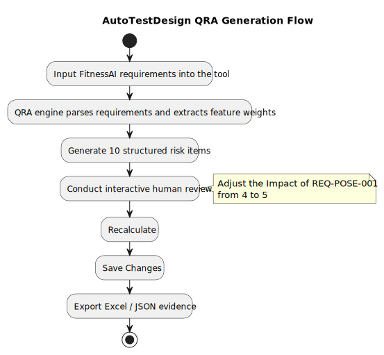

# FitnessAI Risk Analysis Report

> **Document Type**: Risk Analysis Report  
> **Target Application**: FitnessAI - an AI-based intelligent fitness assistant  
> **Report Version**: v2.0  
> **Generation Method**: **Generated by the AutoTestDesign QRA engine (rule engine v2, offline mode) and supplemented through manual review**  
> **Tool Version**: `autotestdesign-engine-v2`, Prompt Version `generation-pipeline-summary`  
> **Date**: 2026-05-25  

---

## Table of Contents

1. [Overview](#1-overview)
2. [Risk Matrix Generated by AutoTestDesign (QRA Output)](#2-risk-matrix-generated-by-autotestdesign-qra-output)
3. [Reviewer-Supplemented Risk Analysis](#3-reviewer-supplemented-risk-analysis)
4. [Consolidated Risk Summary](#4-consolidated-risk-summary)
5. [Risk-Based Test Prioritization](#5-risk-based-test-prioritization)
6. [Appendix A: Screenshot Evidence from Tool Operation](#appendix-a-screenshot-evidence-from-tool-operation)

---

## 1. Overview

### 1.1 Target Application Overview

FitnessAI is an intelligent fitness assistant built on computer vision and AI. It follows a decoupled frontend-backend architecture:

| Component | Technology Stack | Responsibility |
|------|--------|------|
| Backend | Spring Boot 3.2 / Java 17 | REST APIs, pose analysis engine, data persistence |
| Frontend | React + TypeScript | Camera capture, MediaPipe pose detection, UI presentation |
| Database | PostgreSQL (Neon cloud) | User data, exercise records, daily statistics |
| Containerization | Docker Compose | Service orchestration and deployment |

### 1.2 Tool-Driven Generation Flow

The risk matrix in this report is automatically generated by the **QRA (Qualitative Risk Analysis) engine of AutoTestDesign**. The workflow is shown below:

### 1.3 Risk Assessment Method

The report adopts the risk-based testing approach defined in **ISO/IEC/IEEE 29119-1**. The tool uses the following scoring formula:

$$\text{Risk Score} = \text{Impact} \times \text{Likelihood}$$

| Priority | Risk Score Range | Meaning |
|--------|---------|------|
| HIGH | >= 16 | Requires immediate attention |
| MEDIUM | 6-15 | To be addressed within the planned cycle |
| LOW | 1-5 | To be monitored |

---

## 2. Risk Matrix Generated by AutoTestDesign (QRA Output)

> **Data Source**: Automatically generated by the AutoTestDesign QRA engine and then saved after interactive human review.  
> **Engine Time**: 2 ms (see Appendix A for screenshots)

| Req ID | Feature Description | Impact | Likelihood | Risk Score | Priority | Source |
|--------|---------|--------|-----------|-----------|----------|---------|
| **REQ-POSE-001** | pose analysis - valid input handling | **5** *(review-adjusted from 4)* | 3 | **15** | MEDIUM | rule-risk-engine |
| REQ-POSE-001-INV | pose analysis invalid input - invalid input handling | 4 | 3 | 12 | MEDIUM | rule-risk-engine |
| REQ-POSE-002 | state-machine counting - complete counting cycle | 3 | 3 | 9 | MEDIUM | rule-risk-engine |
| REQ-POSE-002-SC | state-machine short cycle - invalid short cycle must not be counted | 3 | 3 | 9 | MEDIUM | rule-risk-engine |
| REQ-REC-001 | record filtering - invalid record filtering (`count < 3 AND duration < 30`) | 3 | 3 | 9 | MEDIUM | rule-risk-engine |
| REQ-REC-001-SAVE | record saving - valid record persistence | 3 | 3 | 9 | MEDIUM | rule-risk-engine |
| REQ-PLAN-001 | training plan easy - easy plan generation | 3 | 3 | 9 | MEDIUM | rule-risk-engine |
| REQ-PLAN-001-MED | training plan medium - medium plan generation | 3 | 3 | 9 | MEDIUM | rule-risk-engine |
| REQ-PLAN-001-HARD | exercise info third-item difficulty check - third-item difficulty validation | 3 | 3 | 9 | MEDIUM | rule-risk-engine |
| REQ-DASH-001 | dashboard calories - calorie calculation (`MET x weight x duration`) | 3 | 3 | 9 | MEDIUM | rule-risk-engine |

**Interactive review record**:
- The reviewer identified `REQ-POSE-001` as the system's highest-frequency API path, so the original automatic score was considered too low.
- `Impact` was adjusted from `4` to **`5`**, and the recalculated `Risk Score` changed from `12` to **`15`**.
- After clicking `Save Changes`, the tool displayed the message `"Risk review saved"` (see Appendix A-1).

---

## 3. Reviewer-Supplemented Risk Analysis

> The QRA engine scores risks based on textual requirement features. The following items are deeper reviewer-supplemented risks derived from source code inspection (such as `UserService.java` and `SquatAnalyzer.java`).

### 3.1 Supplementary Functional Risks

| Risk ID | Related Requirement | Risk Description | Impact | Likelihood | Risk Score | Priority |
|---------|---------|---------|--------|-----------|-----------|----------|
| RA-EXT-001 | REQ-POSE-001 | **No explicit upper bound on landmark count**: request validation enforces a minimum of 33 landmarks, but 34/35 landmarks still enter the analysis pipeline, which makes the upper-bound semantics inconsistent with the intuitive "exactly 33 landmarks" assumption. | 4 | 3 | 12 | M |
| RA-EXT-002 | REQ-POSE-001 | **2D angle calculation ignores the z-axis**: `calculateAngle()` only uses x/y coordinates. Side-view poses may therefore distort angles and cause false counts or missed counts. | 5 | 4 | 20 | **H** |
| RA-EXT-003 | REQ-POSE-002 | **Squat state boundaries require focused validation**: `ANGLE_THRESHOLD` and `STANDING_THRESHOLD` are both 140 degrees. The implementation currently depends on `lastState` and `REQUIRED_FRAMES` for stability, so boundary jitter still deserves targeted testing. | 3 | 4 | 12 | M |
| RA-EXT-004 | REQ-REC-001 | **Filtering logic uses AND instead of OR**: `count < 3 AND duration < 30` means that records with `count >= 3` but `duration < 30` are still stored, which may be questionable from a business perspective. | 4 | 3 | 12 | M |
| RA-EXT-005 | REQ-DASH-001 | **Inconsistent duration units**: `daily_data` returns minutes, while `recent_records` returns seconds. Units are inconsistent within the same API response. | 4 | 4 | 16 | **H** |
| RA-EXT-006 | REQ-DASH-001 | **Default weight of 65kg may introduce large error**: if a user has not configured weight, calorie calculations can deviate by as much as +/-40%. | 3 | 4 | 12 | M |

### 3.2 Supplementary Security Risks

| Risk ID | Risk Description | Impact | Likelihood | Risk Score | Priority |
|---------|---------|--------|-----------|-----------|----------|
| RA-SEC-001 | **No authorization on `userId`**: all `/api/user/{userId}` endpoints are accessed only by string ID, so anyone who knows an ID can operate on another user's data. | 5 | 5 | 25 | **H** |
| RA-SEC-002 | **Unprotected admin cleanup endpoint**: `DELETE /api/user/admin/cleanup` has no authentication, so any request can delete records in bulk. | 5 | 4 | 20 | **H** |
| RA-SEC-003 | **Database credentials committed in plain text**: `docker-compose.yml` hardcodes the full Neon cloud database connection string, including the password. | 5 | 5 | 25 | **H** |
| RA-SEC-004 | **CORS configured as `origins = "*"`**: requests from all origins are allowed. | 4 | 5 | 20 | **H** |

### 3.3 Supplementary Performance Risks

| Risk ID | Risk Description | Impact | Likelihood | Risk Score | Priority |
|---------|---------|--------|-----------|-----------|----------|
| RA-PERF-001 | **No rate limiting for high-frequency pose analysis**: the frontend may issue requests at 10-30 fps in real-time mode, but the backend has no throttling. | 4 | 4 | 16 | **H** |
| RA-PERF-002 | **Full in-memory sorting of history records**: all records are fetched first and sorted in memory, which introduces OOM risk as the dataset grows. | 4 | 2 | 8 | M |

---

## 4. Consolidated Risk Summary

### 4.1 Merged Summary: Tool Output + Reviewer Supplement

| Source | HIGH | MEDIUM | LOW | Total |
|------|------|--------|-----|------|
| Tool-generated QRA items | 0 | 10 | 0 | 10 |
| Reviewer code-inspection additions | 6 | 6 | 0 | 12 |
| **Total** | **6** | **16** | **0** | **22** |

### 4.2 High-Priority Risks Requiring Early Testing

| Risk ID | Summary | Risk Score |
|---------|---------|-----------|
| RA-SEC-001 | Unauthorized cross-user access via `userId` | 25 |
| RA-SEC-003 | Database password committed to the codebase | 25 |
| RA-EXT-002 | 2D angle calculation ignores the z-axis | 20 |
| RA-SEC-002 | Admin endpoint has no authentication | 20 |
| RA-SEC-004 | CORS is open to all origins | 20 |
| RA-EXT-005 | Inconsistent `duration` semantics inside dashboard data | 16 |
| RA-PERF-001 | No throttling under high-frequency requests | 16 |

---

## 5. Risk-Based Test Prioritization

| Test Priority | Covered Risks | Corresponding Test Suite |
|-----------|---------|------------|
| P1 (Immediate) | RA-SEC-001/002/003/004 | Security test suite |
| P2 (Current iteration) | RA-EXT-002, REQ-POSE-001 (Score = 15) | TS-01 Pose analysis |
| P3 (Current iteration) | RA-EXT-004/005, REQ-REC-001 | TS-02 Record filtering |
| P4 (Next iteration) | RA-PERF-001/002 | TS-06 Performance testing |
| P5 (Regression) | Remaining MEDIUM items | Their respective suites |

---

## Appendix A: Screenshot Evidence from Tool Operation

### A-0: Initial QRA Output (Before Review)

> The QRA engine initially generated 10 risk items automatically. `REQ-POSE-001` started with `Impact = 4` and `Risk Score = 12`.

**Screenshot notes**:
- Top status: **"QRA complete. Review and save risk edits before generating test cases."**
- Requirements: **10**, Risk Items: **10**, Engine Time: **2 ms**
- `REQ-POSE-001`: `Impact = 4` (automatic scoring), `Likelihood = 3`, `Risk Score = 12`, `Priority = MEDIUM`
- Tool source labels: `rule-risk-engine` / `risk_config.FEATURE_WEIGHTS`

### A-1: QRA Risk Review Screen (After Interactive Save)

> `REQ-POSE-001` was updated from `Impact = 4` to `Impact = 5`; the `Risk Score` increased to `15`, and the upper-right corner displayed `"Risk review saved"`.

**Screenshot notes**:
- Upper-right status: **"Risk review saved."** (green success message)
- `REQ-POSE-001`: `Impact = 5` (review-adjusted), `Likelihood = 3`, `Risk Score = 15`, `Priority = MEDIUM`
- `REQ-POSE-001-INV`: `Impact = 4`, `Likelihood = 3`, `Risk Score = 12`
- Tool source labels: `rule-risk-engine` / `risk_config.FEATURE_WEIGHTS`

### A-2: Generated Results Summary

> The summary panel shows the full generation metrics and demonstrates that the tool completed all six test design techniques successfully.

| Metric | Value |
|------|------|
| Prompt Version | generation-pipeline-summary |
| Structured Requirements | **10** |
| Coverage Items | **37** |
| Risk Items | **10** |
| **Test Cases** | **81** |
| LLM Enhancements | 4 |
| Design Methods | **6** |
| Engine Time (NFR) | **7 ms** |
| Total Time | **7 ms** |
| NFR Status | ✅ Engine meets the 2s NFR target (LLM adds 0ms) |

---

*This report starts from the base risk matrix generated by the AutoTestDesign QRA engine and is then extended through interactive review and code-level analysis performed by the test design engineer. Exported evidence files: `autotestdesign-[timestamp].json` / `.xlsx`.*
