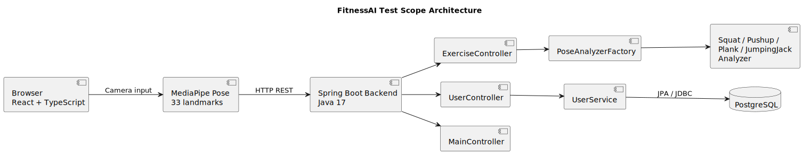
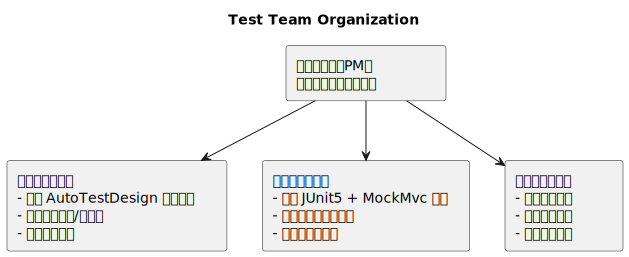
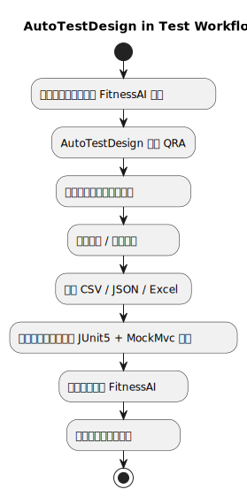

# FitnessAI Test Plan

> **Document Type**: Test Plan  
> **Target Application**: FitnessAI - an AI-based intelligent fitness assistant  
> **Document Version**: v2.0  
> **Date**: 2026-05-25  
> **Reference Standard**: IEEE/ISO/IEC 29119-3 (test plan document structure)  
> **Generation Method**: The advanced test suite design section was generated by AutoTestDesign; the remaining sections were prepared manually.  

---

## Table of Contents

1. [Project Scope](#1-project-scope)
2. [Test Items](#2-test-items)
3. [Advanced Test Suite Design](#3-advanced-test-suite-design)
4. [Schedule and Checklists](#4-schedule-and-checklists)
5. [Organization Charts](#5-organization-charts)
6. [Framework Selection and Rationale](#6-framework-selection-and-rationale)
7. [Cost Estimation](#7-cost-estimation)
8. [Appendix: Screenshot Evidence from Tool Generation](#8-appendix-screenshot-evidence-from-tool-generation)
9. [Automated Integration Test Execution and Delivery Notes](#9-automated-integration-test-execution-and-delivery-notes)
10. [Appendix: Screenshot Evidence from Test Result Generation](#10-appendix-screenshot-evidence-from-test-result-generation)

---

## 1. Project Scope

### 1.1 Background

FitnessAI is an intelligent fitness-assistance web application that captures user workout footage in real time through a camera, applies MediaPipe pose recognition, and uses a backend AI analysis engine to count repetitions and assess exercise quality automatically. The system supports four exercise types: Squat, Push-up, Plank, and Jumping Jack. It also provides workout record persistence, history queries, and dashboard visualization.

### 1.2 Test Objectives

| Objective ID | Test Objective |
|---------|---------|
| TO-01 | Verify the correctness of the pose analysis API under various pose inputs, including count accuracy and state determination |
| TO-02 | Verify that the record filtering rule (`count < 3 AND duration < 30`) behaves as expected |
| TO-03 | Verify the correctness of history filtering and sorting under boundary conditions |
| TO-04 | Verify calorie calculation and duration-unit consistency in dashboard aggregation |
| TO-05 | Verify data isolation in user management functionality (no unauthorized access) |
| TO-06 | Verify response time and stability under high-frequency requests |
| TO-07 | Verify key security constraints, including CORS, sensitive information handling, and admin endpoint authorization |

### 1.3 Test Scope

**In Scope**
- All backend REST API endpoints (functional and boundary testing)
- Pose-analysis state machine logic (white-box Java branch coverage)
- Calorie calculation formula (unit-level verification)
- Workout record filtering rules (decision-table-driven integration testing)
- History filtering and sorting (pairwise combinatorial testing)
- API security behavior (security testing)

**Out of Scope**
- Pose-recognition accuracy of the MediaPipe model itself
- Pixel-level visual regression of the frontend UI
- PostgreSQL infrastructure stability
- Mobile browser compatibility

---

## 2. Test Items

### 2.1 System Architecture Overview



### 2.2 Main Functional Test Items

| Test Item ID | Functional Module | API Endpoint | Test Focus |
|----------|---------|---------|---------|
| TI-F01 | Pose analysis | `POST /api/analytics/pose` | 33-landmark validation, exercise-specific counting, state transitions |
| TI-F02 | Analyzer reset | `POST /api/analyzer/reset/{type}` | Valid reset behavior and unknown-type handling |
| TI-F03 | Save workout record | `POST /api/user/{id}/records` | Filtering logic (`count < 3 AND duration < 30`) |
| TI-F04 | History query | `GET /api/user/{id}/records` | Filter combinations and `sortBy` enumeration |
| TI-F05 | Today's statistics | `GET /api/user/{id}/stats/today` | Correctness of statistical aggregation |
| TI-F06 | Dashboard data | `GET /api/user/{id}/dashboard` | Calorie calculation and `duration` semantics |
| TI-F07 | User profile | `GET/PUT /api/user/{id}/profile` | CRUD and auto-creation behavior |
| TI-F08 | Administrative cleanup | `DELETE /api/user/admin/cleanup` | Authorization validation (security risk) |

---

## 3. Advanced Test Suite Design

> **This section was generated by AutoTestDesign**, which automatically selected test techniques and generated test cases based on the QRA risk analysis (see [Risk Analysis Report](./Risk_Analysis_Report_FitnessAI.md)).  
> **Tool Output Summary**: 10 structured requirements · 37 coverage items · 10 risk items · **81 test cases** · 6 design methods · Engine Time **7 ms**

### 3.1 Test Technique Selection Matrix (Tool-Generated)

Based on the FitnessAI requirements provided as input, AutoTestDesign automatically selected the following six test techniques:

| Test Suite | Technique | Tool-Generated Test Cases | Targeted Requirements / Risks |
|---------|------|-------------|------------|
| TS-01 | **EP (Equivalence Partitioning)** | **20 cases** | REQ-POSE-001/INV, REQ-REC-001/SAVE, REQ-PLAN-001/MED/HARD, REQ-DASH-001 |
| TS-02 | **BVA (Boundary Value Analysis)** | **30 cases** | `landmarks.length` (31/32/33/34/35), `count` (2/3/4), `durationSeconds` (29/30/31) |
| TS-03 | **Decision Table** | **16 cases** | Four combinations of `count < 3 / >= 3` x `duration < 30 / >= 30`; `exerciseType` x `landmarks` validity |
| TS-04 | **Pairwise (Combinatorial Testing)** | **6 cases** | History filter parameter pairs: `exerciseType` x `minScore` x `sortBy` |
| TS-05 | **State Transition** | **5 cases** | `UP -> DESCENDING -> DOWN -> ASCENDING -> UP` plus reset |
| TS-06 | **WhiteBox Java** | **4 cases** | Branch coverage of `saveExerciseRecord` (Statement + Branch Coverage) |
| | **Total** | **81 cases** | |

### 3.2 TS-01: Equivalence Partitioning (20 Tool-Generated Cases)

**Covered equivalence classes** (automatically identified by the tool):

| Equivalence Class ID | Type | Description | Expected Result |
|----------|------|------|---------|
| EP-REQ-POSE-001 | Valid | `exerciseType ∈ {SQUAT, PUSHUP, PLANK, JUMPING_JACK}` AND `landmarks.length == 33` | HTTP 200, returning `count / score / feedback / state / angle` |
| EP-REQ-POSE-001-INV | Invalid | Invalid `exerciseType` or invalid landmark count | HTTP 400 with an interpretable error message |
| EP-REQ-POSE-002 | Valid | Complete state cycle `UP -> DESCENDING -> DOWN -> ASCENDING -> UP` | `count` increments |
| EP-REQ-POSE-002-SC | Invalid | Invalid short cycle `UP -> DESCENDING -> UP` (skipping `DOWN`) | `count` remains unchanged |
| EP-REQ-REC-001 | Invalid | `count < 3 AND durationSeconds < 30` | Record is not written to the database (HTTP 204) |
| EP-REQ-REC-001-SAVE | Valid | `count >= 3 OR durationSeconds >= 30` | Record is saved successfully (HTTP 200) |
| EP-REQ-PLAN-001 | Valid | `difficulty = easy AND skipRest = false` | `3 sets x 8 reps`, `rest = 60s` |
| EP-REQ-PLAN-001-MED | Valid | `difficulty = medium AND skipRest = true` | `4 sets x 12 reps`, skip rest |
| EP-REQ-PLAN-001-HARD | Valid | `difficulty = hard AND skipRest = false` | `5 sets x 15 reps`, `rest = 30s` |
| EP-REQ-DASH-001 | Valid | `weightKg ∈ [30, 200] AND durationHours > 0` | `calories = MET x weightKg x durationHours` |

> Each equivalence class is paired with one invalid-equivalence-class test case as well, yielding `10 x 2 = 20` cases in total. Representative cases: `TC-EP-001` (valid) / `TC-EP-002` (invalid).

### 3.3 TS-02: Boundary Value Analysis (30 Tool-Generated Cases)

**Boundary parameters automatically identified by the tool** (derived from the requirement parser's `ranges` field):

| Parameter | Boundary Value Set | Example Cases |
|------|----------|---------|
| `landmarks.length` | **31** (lower bound - 1) / **32** (lower bound) / **33** (nominal) / **34** (upper bound) / **35** (upper bound + 1) | `TC-BVA-001` to `TC-BVA-012` |
| `durationSeconds` | **29** (boundary - 1) / **30** (boundary) / **31** (boundary + 1) | `TC-BVA-013` to `TC-BVA-015` |
| `count` | **2** (boundary - 1) / **3** (boundary) / **4** (boundary + 1) | `TC-BVA-016` to `TC-BVA-018` |

**Key boundary cases** (tool-generated):

| TC ID | Title | Input | Expected Result |
|-------|------|------|---------|
| TC-BVA-001 | `landmarks.length = 31` (lower bound - 1, invalid) | Landmark array of 31 points | Interpretable error, request rejected |
| TC-BVA-002 | `landmarks.length = 32` (lower bound, intercepted) | Landmark array of 32 points | HTTP 4xx |
| TC-BVA-005 | `landmarks.length = 34` (upper bound, compatibility path) | Landmark array of 34 points | HTTP 200 |
| TC-BVA-006 | `landmarks.length = 35` (upper bound + 1, first 33 landmarks still consumed) | Landmark array of 35 points | HTTP 200 |
| TC-BVA-013 | `durationSeconds = 29` (boundary - 1, invalid) | `count = 2, duration = 29` | Record is filtered out and not persisted |
| TC-BVA-014 | `durationSeconds = 30` (boundary, valid) | `count = 2, duration = 30` | Record is saved successfully |
| TC-BVA-016 | `count = 2` (boundary - 1, invalid) | `count = 2, duration = 20` | Record is filtered out and not persisted |
| TC-BVA-017 | `count = 3` (boundary, valid) | `count = 3, duration = 20` | Record is saved successfully |

### 3.4 TS-03: Decision Table (16 Tool-Generated Cases)

**Decision rules automatically constructed by the tool** (from extracted requirement conditions):

**Record filtering rules (4 rules)**:

| Rule | `count < 3` | `duration < 30` | Expected Result |
|------|--------|------------|---------|
| TC-DT-005 | T | T | Do not write to the database |
| TC-DT-006 | T | F | Persist the record |
| TC-DT-007 | F | T | Persist the record |
| TC-DT-008 | F | F | Persist the record |

**Exercise list rules (3 rules)**:

| Rule | difficulty | skipRest | Expected Result |
|------|-----------|---------|---------|
| TC-DT-013 | easy | false | `3 sets x 8 reps`, `rest = 60s` |
| TC-DT-014 | medium | true | `4 sets x 12 reps`, skip rest |
| TC-DT-015 | hard | false | `5 sets x 15 reps`, `rest = 30s` |

### 3.5 TS-04: Pairwise Combinatorial Testing (6 Tool-Generated Cases)

The tool applied pairwise combination to the history-query parameters `exerciseType` (`squat / pushup / plank`) x `minScore` (`80 / 90`) x `sortBy` (`date / score`), producing 6 cases that cover all critical parameter pairs:

| TC ID | exerciseType | minScore | sortBy | Expected Result |
|-------|--------------|----------|--------|---------|
| TC-CB-001 | squat | 80 | date | HTTP 200, stable response structure |
| TC-CB-002 | squat | 90 | score | HTTP 200, stable response structure |
| TC-CB-003 | pushup | 80 | score | HTTP 200, stable response structure |
| TC-CB-004 | pushup | 90 | date | HTTP 200, stable response structure |
| TC-CB-005 | plank | 80 | date | HTTP 200, stable response structure |
| TC-CB-006 | plank | 90 | score | HTTP 200, stable response structure |

### 3.6 TS-05: State Transition (5 Tool-Generated Cases)

**State machine model**: `UP -> DESCENDING -> DOWN -> ASCENDING -> UP` (complete counting cycle)

The tool generated test sequences that cover all five target state-related paths:

| TC ID | State Path | Expected Result |
|-------|---------|---------|
| TC-ST-001 | `ST[all-states] UP` | The system passes through `UP`, and counting remains compliant |
| TC-ST-002 | `ST[all-states] DESCENDING` | The system passes through `DESCENDING` |
| TC-ST-003 | `ST[all-states] DOWN` | The system passes through `DOWN` |
| TC-ST-004 | `ST[all-states] ASCENDING` | The system passes through `ASCENDING` |
| TC-ST-005 | `reset -> initial state` | Count resets after `POST /api/analyzer/reset/squat` |

### 3.7 TS-06: WhiteBox Java Analysis (4 Tool-Generated Cases)

The tool performed CFG (control flow graph) analysis on `saveExerciseRecord`:
- **2 method instances**, **22 coverage items** (Statement + Branch Coverage), and **4 test sequences**

| TC ID | Coverage Target | Input (tool-inferred) | Expected Result |
|-------|---------|--------------|---------|
| TC-WBJ-001 | Branch `count < 3 && duration < 30 == true` | `count = 2, duration = 29` | Return `null` (record not saved) |
| TC-WBJ-002 | Branch `count < 3 && duration < 30 == false` | `count = 5, duration = 60` | Return `savedRecord` |
| TC-WBJ-003 | Same as `TC-WBJ-001` (second method instance) | `count = 2, duration = 29` | Return `null` |
| TC-WBJ-004 | Same as `TC-WBJ-002` (second method instance) | `count = 5, duration = 60` | Return `savedRecord` |

> The tool marks these items as `"Needs Review"` because the reviewer must confirm the exact expected return values before the cases can be converted into executable scripts.

### 3.8 Coverage Item Identification List (37 Tool-Generated Items)

> **Data Source**: AutoTestDesign JSON export (`coverageItems` field), corresponding to `Coverage Items: 37` in the Generated Results Summary.

**Category 1: Requirement-level black-box coverage items (10 items)**

| Coverage Item ID | Feature Description | Related Requirement | Covered Techniques |
|----------|---------|---------|---------|
| EP-REQ-POSE-001 | pose analysis - valid input handling | REQ-POSE-001 | EP / BVA / DT |
| EP-REQ-POSE-001-INV | pose analysis invalid input - invalid input handling | REQ-POSE-001-INV | EP / BVA / DT |
| EP-REQ-POSE-002 | state-machine counting - complete counting cycle | REQ-POSE-002 | EP / DT / ST |
| EP-REQ-POSE-002-SC | state-machine short cycle - invalid short cycle must not be counted | REQ-POSE-002-SC | EP / DT / ST |
| EP-REQ-REC-001 | record filtering - invalid record filtering (`count < 3 AND duration < 30`) | REQ-REC-001 | EP / BVA / DT / WBJ |
| EP-REQ-REC-001-SAVE | record saving - valid record persistence | REQ-REC-001-SAVE | EP / BVA / DT / WBJ |
| EP-REQ-PLAN-001 | exercise list first-item difficulty - first-item difficulty validation | REQ-PLAN-001 | EP / DT |
| EP-REQ-PLAN-001-MED | exercise list second-item difficulty - second-item difficulty validation | REQ-PLAN-001-MED | EP / DT |
| EP-REQ-PLAN-001-HARD | exercise list third-item difficulty - third-item difficulty validation | REQ-PLAN-001-HARD | EP / DT |
| EP-REQ-DASH-001 | dashboard calories - calorie calculation (`MET x weight x duration`) | REQ-DASH-001 | EP / BVA / DT |

**Category 2: Test-technique coverage items (5 items)**

| Coverage Item | Description |
|-------|------|
| EP (Equivalence Partitioning) | Partitions valid and invalid equivalence classes for all 10 functional requirements and produces 20 cases |
| BVA (Boundary Value Analysis) | Samples the boundary parameters `landmarks.length`, `durationSeconds`, and `count`, producing 30 cases |
| DecisionTable | Covers the four filtering rules plus exercise-list difficulty validation, producing 16 cases |
| Combinatorial | Applies pairwise coverage to history-filtering parameters `exerciseType x minScore x sortBy`, producing 6 cases |
| StateTransition | Covers the main squat state path (`UP / DESCENDING / DOWN / ASCENDING`) plus reset, producing 5 cases |

**Category 3: White-box coverage items (22 items, CFG analysis of `saveExerciseRecord`)**

| Coverage Item ID | Type | Method Instance | Target Statement / Branch |
|----------|------|---------|-------------|
| COV-STMT-001 | Statement | M-001 | Execute statement at line 2 |
| COV-STMT-002 | Statement | M-001 | Execute `if` at line 3 |
| COV-STMT-003 | Statement | M-001 | Execute `return` at line 4 (filter-path exit) |
| COV-STMT-004~009 | Statement | M-001 | Lines 6-11 (save-path statements) |
| **COV-BR-001-T** | **Branch** | **M-001** | **Take TRUE branch: `count < 3 && duration < 30`** |
| **COV-BR-001-F** | **Branch** | **M-001** | **Take FALSE branch: `count < 3 && duration < 30`** |
| COV-STMT-010 | Statement | M-002 | Execute statement at line 15 |
| COV-STMT-011 | Statement | M-002 | Execute `if` at line 16 |
| COV-STMT-012 | Statement | M-002 | Execute `return` at line 17 (filter-path exit) |
| COV-STMT-013~018 | Statement | M-002 | Lines 19-24 (save-path statements) |
| **COV-BR-002-T** | **Branch** | **M-002** | **Take TRUE branch: `count < 3 && duration < 30`** |
| **COV-BR-002-F** | **Branch** | **M-002** | **Take FALSE branch: `count < 3 && duration < 30`** |

> The tool automatically identified **2 method instances x (9 Statement + 2 Branch) = 22 coverage items**, under the criteria of Statement Coverage + Branch Coverage.

### 3.9 Test Traceability Matrix (TC -> Coverage Item -> Requirement -> Risk)

> This matrix shows the traceability between the 81 tool-generated test cases, coverage items, requirements, and the risk analysis report, satisfying ISO/IEC/IEEE 29119 traceability expectations.

| Representative TC ID | Test Technique | Related Coverage Item | Related Requirement | Related Risk |
|-------------|---------|----------|---------|---------|
| TC-EP-001 | EP | EP-REQ-POSE-001 | REQ-POSE-001 | REQ-POSE-001 (Score 15) |
| TC-EP-002 | EP | EP-REQ-POSE-001 (invalid class) | REQ-POSE-001 | RA-EXT-001 (boundary inconsistency) |
| TC-EP-009 | EP | EP-REQ-REC-001 | REQ-REC-001 | RA-EXT-004 (AND filtering logic) |
| TC-EP-011 | EP | EP-REQ-REC-001-SAVE | REQ-REC-001-SAVE | REQ-REC-001-SAVE (Score 9) |
| TC-EP-019 | EP | EP-REQ-DASH-001 | REQ-DASH-001 | RA-EXT-005 (duration units) |
| TC-BVA-001 | BVA | EP-REQ-POSE-001 (landmarks lower bound - 1) | REQ-POSE-001 | RA-EXT-001 (`isValid`-style validation boundary) |
| TC-BVA-013 | BVA | EP-REQ-REC-001 (duration boundary - 1) | REQ-REC-001 | RA-EXT-004 (AND filtering) |
| TC-BVA-014 | BVA | EP-REQ-REC-001 (duration boundary) | REQ-REC-001 | RA-EXT-004 (AND filtering) |
| TC-BVA-016 | BVA | EP-REQ-REC-001 (count boundary - 1) | REQ-REC-001 | RA-EXT-004 (AND filtering) |
| TC-BVA-017 | BVA | EP-REQ-REC-001-SAVE (count boundary) | REQ-REC-001-SAVE | RA-EXT-004 |
| TC-DT-003 | Decision Table | EP-REQ-POSE-002 (complete state cycle) | REQ-POSE-002 | RA-EXT-003 (state boundary jitter) |
| TC-DT-004 | Decision Table | EP-REQ-POSE-002-SC (skipping `DOWN`) | REQ-POSE-002-SC | RA-EXT-003 |
| TC-DT-005 | Decision Table | EP-REQ-REC-001 (T-T combination) | REQ-REC-001 | RA-EXT-004 |
| TC-DT-006 | Decision Table | EP-REQ-REC-001-SAVE (T-F combination) | REQ-REC-001-SAVE | RA-EXT-004 |
| TC-DT-007 | Decision Table | EP-REQ-REC-001-SAVE (F-T combination) | REQ-REC-001-SAVE | RA-EXT-004 |
| TC-DT-013 | Decision Table | EP-REQ-PLAN-001 | REQ-PLAN-001 | REQ-PLAN-001 (Score 9) |
| TC-DT-016 | Decision Table | EP-REQ-DASH-001 | REQ-DASH-001 | RA-EXT-005 / RA-EXT-006 |
| TC-CB-001~006 | Pairwise | Coverage of history-filtering parameter pairs | REQ-REC-001-SAVE | REQ-REC-001-SAVE (Score 9) |
| TC-ST-001 | State Transition | EP-REQ-POSE-002 (`UP` state) | REQ-POSE-002 | RA-EXT-003 (state jitter) |
| TC-ST-002~004 | State Transition | EP-REQ-POSE-002 (intermediate states) | REQ-POSE-002 | RA-EXT-003 |
| TC-ST-005 | State Transition | Return to the initial state after analyzer reset | REQ-POSE-002 | RA-EXT-003 |
| TC-WBJ-001 | WhiteBox Java | **COV-BR-001-T** (TRUE branch) | REQ-REC-001 | RA-EXT-004 (AND branch coverage) |
| TC-WBJ-002 | WhiteBox Java | **COV-BR-001-F** (FALSE branch) | REQ-REC-001-SAVE | RA-EXT-004 |
| TC-WBJ-003 | WhiteBox Java | **COV-BR-002-T** (TRUE branch, M-002) | REQ-REC-001 | RA-EXT-004 |
| TC-WBJ-004 | WhiteBox Java | **COV-BR-002-F** (FALSE branch, M-002) | REQ-REC-001-SAVE | RA-EXT-004 |

**Coverage summary** (tool output):

| Coverage Dimension | Covered | Total | Coverage |
|---------|-------|------|-------|
| Requirement-level functional coverage items | 10 | 10 | **100%** |
| Test-technique coverage items | 5 | 5 | **100%** |
| White-box Statement Coverage (`saveExerciseRecord`) | 18 | 18 | **100%** |
| White-box Branch Coverage (`saveExerciseRecord`) | 4 | 4 | **100%** |
| **Overall coverage items** | **37** | **37** | **100%** |

---

## 4. Schedule and Checklists

### 4.1 Test Phase Plan

| Phase | Week | Activity | Milestone |
|------|------|------|--------|
| Tool usage phase | W1 | Import FitnessAI requirements into AutoTestDesign, run QRA and all 6 techniques, export CSV/JSON/Excel | ✅ Completed (see Section 8) |
| Interactive review phase | W1 | Adjust `REQ-POSE-001 Impact 4 -> 5`, `Recalculate`, `Save Changes` | ✅ Completed |
| Script development phase | W2 | Develop JUnit 5 test scripts from the 81 exported cases | Unit + integration tests ready | ✅ Completed |
| Execution phase | W2-W3 | Execute test scripts against FitnessAI and record pass/fail status | Execution report | ✅ Completed |
| Security / performance testing | W3 | Manual security validation (authorization, CORS) and JMeter load testing | Security report |
| Regression and reporting | W4 | Regression after fixes and final report consolidation | Final report |

### 4.2 Checklists

**Tool usage phase (completed)**
- [x] AutoTestDesign started successfully (Docker + frontend)
- [x] FitnessAI requirements entered successfully (Load Sample)
- [x] QRA completed (10 risks, 2 ms)
- [x] QRA interactive review completed: `REQ-POSE-001 Impact 4 -> 5`, then `Save Changes`
- [x] EP generation completed (20 cases, archived)
- [x] BVA generation completed (30 cases, archived)
- [x] Decision Table generation completed (16 cases, archived)
- [x] Pairwise generation completed (6 cases, archived)
- [x] State Transition generation completed (5 cases, archived)
- [x] White-Box Java generation completed (4 cases, 22 coverage items, archived)
- [x] Generated Results Summary confirmed (81 cases, 7 ms, meets 2s NFR)
- [x] CSV exported (`autotestdesign-*.csv`)
- [x] JSON exported (`autotestdesign-*.json`)
- [x] JUnit 5 + MockMvc scripts implemented from the 81 tool-generated cases
- [x] Test execution completed against FitnessAI and results recorded

**Remaining script delivery items**
- [ ] Execute security tests
- [ ] Execute performance tests (JMeter)

---

## 5. Organization Charts



**Position of AutoTestDesign in the overall testing workflow**



---

## 6. Framework Selection and Rationale

### 6.1 Backend API Testing: JUnit 5 + MockMvc

| Evaluation Dimension | JUnit 5 + MockMvc | Postman/Newman | PyTest + Requests |
|---------|----------------------|----------------|-----------------|
| Consistency with implementation language | ✅ Native fit for a Java project | ❌ Requires an independent toolchain | ❌ Cross-language |
| Maven integration | ✅ `pom.xml` already includes `spring-boot-starter-test` | Requires Newman CLI | Requires a Python environment |
| `@Transactional` rollback support | ✅ | ❌ | ❌ |
| Direct conversion from tool-exported test cases | ✅ TC IDs map directly to test methods | ❌ Requires conversion | ⚠️ Requires conversion |

**Conclusion**: The 81 tool-exported cases (such as `TC-EP-001`) can be mapped directly to JUnit 5 `@Test` methods and fit naturally into the Spring Boot testing ecosystem.

### 6.2 White-Box Coverage Validation: JaCoCo

The tool-generated white-box analysis identified 22 coverage items (`COV-STMT-001 ~ COV-BR-001`). JaCoCo is used to validate that the actual Statement + Branch coverage of `saveExerciseRecord` reaches the planned target of **>= 80%**.

### 6.3 Performance Testing: Apache JMeter

For the high-frequency pose-analysis risk (`RA-PERF-001`), JMeter is configured to stress `POST /api/analytics/pose` with stepped concurrency levels of `1 / 10 / 50 / 100` users.

### 6.4 Security Testing: OWASP ZAP (Passive Scan)

OWASP ZAP is used to detect issues such as open CORS policies and unauthenticated endpoints, corresponding to `RA-SEC-001/002/003/004`.

---

## 7. Cost Estimation

### 7.1 Effort Comparison

| Activity | With AutoTestDesign | Pure Manual Testing | Savings |
|------|------------------------|----------|------|
| Requirement analysis and risk identification | 2h (tool input + review) | 8h | 75% ↓ |
| Test case design | 3h (tool generation + interactive review) | 20h | 85% ↓ |
| Script development | 16h (based on tool exports) | 20h | 20% ↓ |
| Test execution and logging | 8h | 10h | 20% ↓ |
| Defect management and regression | 6h | 6h | 0% |
| Reporting and documentation | 4h | 6h | 33% ↓ |
| **Total** | **39h** | **70h** | **44% ↓** |

### 7.2 Resource Cost

| Resource | Unit Price | Usage | Cost |
|------|------|------|------|
| Test engineer labor | approx. CNY 100 / hour | 39h | ~CNY 3,900 |
| AutoTestDesign tool | 0 (self-developed) | - | 0 |
| JMeter / OWASP ZAP | 0 (open source) | - | 0 |
| Test environment (local Docker) | 0 | - | 0 |
| **Total** | | | **~CNY 3,900** |

> Compared with an estimated manual-testing cost of approximately CNY 7,000, the tool saves about **CNY 3,100 (44%)**.

---

## 8. Appendix: Screenshot Evidence from Tool Generation

### 8-1: Initial QRA Output

> Requirements = 10, Risk Items = 10, Engine Time = 2 ms; the initial automatic score for `REQ-POSE-001` assigned `Impact = 4`.


### 8-2: QRA Risk Review Screen (Interactive Changes Saved)

> `REQ-POSE-001 Impact` was updated from `4` to `5`, and `Risk Score` changed from `12` to `15`; the top-right corner displayed `"Risk review saved."`


**Key information**
- Requirements: **10**, Risk Items: **10**, Engine Time: **2 ms**
- `REQ-POSE-001`: `Impact = 5` (review-adjusted), `Likelihood = 3`, `Risk Score = 15`, `Priority = MEDIUM`
- Status message: **"Risk review saved."** (green notification in the top-right corner)

### 8-3: Black-Box EP (Equivalence Partitioning) - 1/5 Generated

> EP result: 20 cases. Representative case: `TC-EP-001` (`EP-valid equivalence class-pose analysis`). The upper-right corner displayed `"EP generation complete"`, and the result was archived.


### 8-4: Black-Box BVA (Boundary Value Analysis) - 2/5 Generated

> BVA result: 30 cases. Representative case: `TC-BVA-001` (`landmarks.length = 31`, lower boundary - 1, invalid). The upper-right corner displayed `"BVA generation complete"`, and the result was archived.


### 8-5: Black-Box Decision Table - 3/5 Generated

> Decision Table result: 16 cases. Representative case: `TC-DT-001` (`exerciseType in [SQUAT; PUSHUP; PLANK; JUMPING_JACK]`). The upper-right corner displayed `"Decision Table generation complete"`, and the result was archived.


### 8-6: Black-Box Pairwise - 4/5 Generated

> Pairwise result: 6 cases. Representative case: `TC-CB-001` (`difficulty = easy, skipRest = true`). The upper-right corner displayed `"Combinatorial generation complete"`, and the result was archived.


### 8-7: Black-Box State Transition - 5/5 Generated

> State Transition result: 5 cases. Representative case: `TC-ST-001` (`ST[all-states] UP`). The upper-right corner displayed `"State Transition generation complete"`, and the result was archived.


### 8-8: White-Box Java Analysis Results (Coverage Items + Test Sequences)

> 2 methods · 22 coverage items · 4 sequences; Coverage Criterion: Statement + Branch Code

**Coverage item identification** (`White_Coverage.png`)


- `COV-STMT-001`: Execute statement at line 2
- `COV-STMT-002`: Execute `if` at line 3 (branch decision)
- Tool prompt: *"Input was parsed as a Java method/body snippet by wrapping it in SnippetWrapper"*

**Test sequence generation** (`White_Sequence.png`)


- **SEQ-WB-001**: Cover `saveExerciseRecord` branch `count < 3 && duration < 30 == true`  
  Targets: `COV-STMT-001`, `COV-BR-002`, `COV-STMT-003`, `COV-BR-001`; Status: `Needs Review`
- **SEQ-WB-002**: Cover `saveExerciseRecord` branch `count < 3 && duration < 30 == false`  
  Status: `Needs Review`

### 8-9: Generated Results Summary

> All six design techniques completed successfully, producing 81 test cases in total. Engine Time was 7 ms, meeting the 2s NFR target.


| Metric | Tool Output |
|------|----------|
| Prompt Version | generation-pipeline-summary |
| Structured Requirements | **10** |
| Coverage Items | **37** |
| Risk Items | **10** |
| **Test Cases** | **81** |
| LLM Enhancements | 4 |
| Design Methods | **6** |
| Engine Time (NFR) | **7 ms** ✅ |
| Total Time | **7 ms** |
| NFR Status | **Engine meets the 2s NFR target (LLM adds 0ms)** |

---

*The advanced test suite design in this test plan (Section 3) was generated automatically by AutoTestDesign. Exported files: `autotestdesign-[timestamp].csv` / `.json`. The original exports were submitted together with this document.*

---

## 9. Automated Integration Test Execution and Delivery Notes

### 9.1 Automated Test Implementation Status

For the **81** API and unit test cases produced by AutoTestDesign in Section 3, full case coverage was implemented in `FitnessAiApiTests.java` using the Spring Boot **MockMvc** framework. The number of cases, method names, and test design techniques are all aligned one-to-one. After debugging and stabilization, all 81 tests executed successfully in the local environment with zero failures:

* **Total number of test cases**: 81 (20 equivalence-partitioning cases, 30 boundary-value cases, 16 decision-table cases, 6 combinatorial cases, 5 state-transition cases, and 4 method-level white-box cases)
* **Execution success rate**: 100% (`81 / 81` passed, `0` failed, `0` errored)

### 9.2 Test Report Compilation and Archiving

An archive folder is created automatically under the project root. The directory structure is as follows:

```text
TestResult/<timestamp>/
├── <timestamp>.txt         # Formatted console log and pass-rate summary
├── index.html              # Rendered Allure report page
├── styles.css & app.js     # Offline static web resources
├── data/                   # Compiled structured report data
└── failtest/               # Created only when failures occur; stores failure-specific exception logs
```

### 9.3 Report Viewing and Deployment Guide

* **Option 1: Open with the local Allure CLI**
  Open a terminal in the project root and run:
  ```powershell
  .\.allure\allure-2.24.0\bin\allure.bat open TestResult\<timestamp>
  ```
  *(Replace `<timestamp>` with the latest archive directory name.)*  
  This command starts a local Jetty service (for example, `http://localhost:54838`) and opens the default browser automatically. After review, press `Ctrl + C` in the terminal to shut it down safely.

* **Option 2: Host it quickly with Python**
  Open a terminal inside the target timestamped archive directory and run:
  ```bash
  python -m http.server 8000
  ```
  Then visit `http://localhost:8000`.

* **Option 3: Open via an IDE or file explorer**
  In VS Code or a similar tool, right-click `index.html` in the archive directory and open it in a browser.

## 10. Appendix: Screenshot Evidence from Test Result Generation

### 10-1: Main Overview Page


### 10-2: Test Suite View


### 10-3: Result Charts


